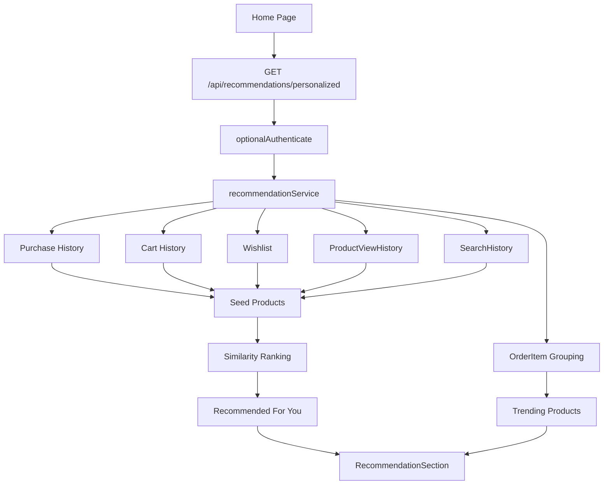

# Sunspot - Electronic Online Shop Machine Learning

Sunspot is a Machine Learning project for analyzing and predicting product demand in an electronic online shop. The target variable is `DemandLevel`, with three classes: `Low`, `Medium`, and `High`.

## Project Overview

The project includes:

- Synthetic but realistic electronic product dataset generation
- Data cleaning and quality visualizations
- Exploratory Data Analysis
- Machine Learning preprocessing pipeline
- KNN, Decision Tree, Random Forest, Logistic Regression, SVM
- Neural Network Architecture 1 and Architecture 2
- Neural Network hyperparameter tuning
- K-Means clustering with elbow and silhouette analysis
- Cluster comparison with real `DemandLevel` labels
- Feature selection methods
- Final model comparison and university-style report

## Main Structure

```text
frontend/
  src/
  public/
  package.json
  vite.config.ts

backend/
  src/
  prisma/

data/
  sunspot_electronic_online_shop.csv

ml/
  sunspot_electronic_online_shop_pipeline.py

notebooks/
  sunspot_electronic_online_shop_analysis.ipynb

reports/
  sunspot_electronic_online_shop_final_report.md
  sunspot_electronic_online_shop_final_report.docx

outputs/
  sunspot_electronic_online_shop/

docs/
```

## Dataset

The main dataset is:

```text
data/sunspot_electronic_online_shop.csv
```

It contains product features such as category, brand, price, rating, reviews, stock quantity, discount, warranty, sold units, and demand level.

For model training, the integrated pipeline excludes:

- `ProductID`
- `ProductName`
- `SoldUnits`

`ProductID` and `ProductName` are identifiers/text fields. `SoldUnits` is excluded to avoid target leakage because it is strongly connected to `DemandLevel`.

## Installation

```bash
npm run install:all
pip install -r requirements.txt
```

Optional notebook/report tooling:

```bash
pip install -r requirements-notebooks.txt
```

## Database Setup

The backend uses PostgreSQL for relational data, MongoDB for notification/activity history, and Redis for cache.

Start MongoDB and Redis with Docker:

```bash
npm run infra:start
```

Copy `backend/.env.example` to `backend/.env`, then update `DATABASE_URL`, `MONGO_URL`, `REDIS_URL`, and Stripe keys if your local ports or payment credentials are different.

```bash
copy backend\.env.example backend\.env
npm run backend:setup
```

`npm run backend:setup` generates the Prisma client, runs PostgreSQL migrations, and seeds roles, permissions, admin user, categories, brands, and sample products.

## Stripe Payment Setup

Create a Stripe test account and add these values to `backend/.env`:

```env
STRIPE_SECRET_KEY=sk_test_your_key
STRIPE_PUBLISHABLE_KEY=pk_test_your_key
STRIPE_WEBHOOK_SECRET=whsec_your_webhook_secret
STRIPE_CURRENCY=usd
```

For local webhook testing:

```bash
stripe listen --forward-to localhost:5000/api/payments/webhook
```

Use Stripe test card `4242 4242 4242 4242`, any future expiry date, any CVC, and any ZIP/postal code.

## Run The Main ML Pipeline

```bash
python ml/sunspot_electronic_online_shop_pipeline.py
```

The pipeline creates outputs in:

```text
outputs/sunspot_electronic_online_shop/
```

Including:

- Final model comparison table
- Confusion matrices
- Neural Network GridSearchCV results
- Best Neural Network configuration
- K-Means cluster metrics
- Elbow curve
- Silhouette score plot
- PCA cluster visualizations
- Cluster-label comparison heatmap

## Run The Web App

```bash
npm run infra:start
npm run backend:dev
npm run dev
```

Then open:

```text
http://localhost:3000
```

## Admin Audit Logs Module

Admin users can open:

```text
http://localhost:3000/admin/audit-logs
```

The page lists important system activity from the existing `audit_logs` table with search, filters, date sorting, pagination, and CSV/Excel export.

Tracked actions:

- Login
- Logout
- Register
- Product Create
- Product Update
- Product Delete
- Order Create
- Order Status Change
- User Role Change
- CMS Update
- Report Export

Backend endpoints:

```text
GET /api/admin/audit-logs
GET /api/admin/audit-logs/export/csv
GET /api/admin/audit-logs/export/excel
```

Supported filters:

- `search`
- `user`
- `action`
- `entity`
- `dateFrom`
- `dateTo`
- `page`
- `pageSize`
- `sortOrder`

Files created:

- `backend/src/repositories/auditLogRepository.js`
- `backend/src/services/auditLogService.js`
- `backend/src/controllers/auditLogController.js`
- `backend/src/routes/auditLogRoutes.js`
- `backend/src/utils/auditContext.js`
- `frontend/src/pages/AdminAuditLogsPage.tsx`

Files modified:

- `README.md`
- `backend/src/routes/index.js`
- `backend/src/config/swagger.js`
- `backend/src/controllers/authController.js`
- `backend/src/services/authService.js`
- `backend/src/controllers/catalogController.js`
- `backend/src/services/catalogService.js`
- `backend/src/controllers/orderController.js`
- `backend/src/services/orderService.js`
- `backend/src/controllers/adminController.js`
- `backend/src/controllers/advancedController.js`
- `backend/src/services/cmsService.js`
- `frontend/src/services/adminService.ts`
- `frontend/src/types/index.ts`
- `frontend/src/routes/AppRoutes.tsx`
- `frontend/src/pages/AdminDashboardPage.tsx`
- `backend/README.md`
- `docs/api-documentation.md`

Architecture:

```text
AdminAuditLogsPage
  -> adminService.ts
  -> GET /api/admin/audit-logs
  -> auditLogRoutes
  -> auditLogController
  -> auditLogService
  -> auditLogRepository
  -> Prisma AuditLog model
```

The service layer builds filtering, search, pagination, date sorting, and export rows. The repository is the only layer that queries `prisma.auditLog`. Tracked actions are recorded through `recordAuditLogSafe`, which stores old and new values in `metadata.oldValue` and `metadata.newValue` so the existing table can be reused without a migration.

## Similar Products Recommendation Widget

The Product Details page includes a reusable "Similar Products" widget backed by the existing recommendation engine.

Backend endpoint:

```text
GET /api/recommendations/similar/:productId
```

The endpoint returns:

- Similar products
- `similarityScore` for each product

Similarity is calculated from:

- Category
- Brand
- Price closeness
- Rating closeness
- Product feature overlap

Files created:

- `frontend/src/components/SimilarProductsWidget.tsx`

Files modified:

- `README.md`
- `backend/src/services/recommendationService.js`
- `backend/src/controllers/advancedController.js`
- `backend/src/routes/advancedRoutes.js`
- `backend/README.md`
- `docs/api-documentation.md`
- `frontend/src/services/recommendationService.ts`
- `frontend/src/pages/ProductDetailsPage.tsx`
- `frontend/src/types/index.ts`
- `frontend/src/utils/products.ts`

Architecture:

```text
ProductDetailsPage
  -> SimilarProductsWidget
  -> recommendationService.ts
  -> GET /api/recommendations/similar/:productId
  -> advancedRoutes
  -> similarProductsController
  -> recommendationService.js
  -> Prisma Product model
```

The backend service reuses the recommendation layer and returns serialized products with `similarityScore`. The frontend widget owns loading and error states, then renders product image, name, price, rating, and match percentage in the current glass-card design.

## Personalized Recommendations

The Home Page includes ML-backed sections for:

- Recommended For You
- Trending Products

Backend endpoint:

```text
GET /api/recommendations/personalized
```

The endpoint returns:

- `personalizedProducts`
- `frequentlyBoughtTogether`
- `trendingProducts`
- `fallback`
- `signals`

Recommendation signals:

- Purchase History from orders and order items
- Cart History from current cart items
- Wishlist from saved products
- Product Views from MongoDB `ProductViewHistory`
- Search History from MongoDB `SearchHistory`

Fallback:

- Guests and users with no history receive popular/trending products.

Files created:

- `frontend/src/components/RecommendationSection.tsx`

Files modified:

- `README.md`
- `backend/src/middleware/authMiddleware.js`
- `backend/src/services/recommendationService.js`
- `backend/src/controllers/advancedController.js`
- `backend/src/routes/advancedRoutes.js`
- `backend/README.md`
- `docs/api-documentation.md`
- `frontend/src/services/recommendationService.ts`
- `frontend/src/pages/HomePage.tsx`
- `frontend/src/pages/ProductDetailsPage.tsx`
- `frontend/src/types/index.ts`
- `frontend/src/utils/products.ts`

ML integration explanation:

The recommendation service gathers user signals from relational commerce data and MongoDB behavior collections, converts those signals into seed products, then ranks candidate products with the existing similarity scoring logic. The scoring compares category, brand, price, rating, and feature tokens. Trending products are generated from purchased quantities first, then fall back to high-rated and recent active products.

Recommendation flow diagram:



## Light And Dark Theme System

The frontend includes a global light/dark mode system with a toggle in the Navbar.

Features:

- Moon icon for dark mode
- Sun icon for light mode
- Desktop toggle beside notifications/user actions
- Mobile toggle inside the mobile menu
- Instant global theme update
- `localStorage` persistence through refresh, login, and logout
- Initial theme script in `index.html` to reduce flash before React loads
- Smooth color and background transitions

Files created:

- `frontend/src/context/ThemeContext.tsx`
- `frontend/src/components/ThemeToggle.tsx`

Files modified:

- `README.md`
- `frontend/index.html`
- `frontend/src/main.tsx`
- `frontend/src/components/Navbar.tsx`
- `frontend/src/styles/globals.css`

Theme architecture:

```text
index.html initial theme script
  -> ThemeProvider
  -> ThemeContext
  -> ThemeToggle
  -> html.theme-light / html.theme-dark
  -> globals.css theme variables and utility overrides
  -> Navbar, Home, Products, Product Details, Cart, Checkout, Dashboard, Admin, CMS, Reports
```

The provider stores `sunspot_theme` in `localStorage` and applies `theme-light` or `theme-dark` on the document root. The CSS layer keeps the current palette and glass-card design, then remaps existing Tailwind utilities for light mode so pages inherit the theme without UI redesign.

Before/after screenshots list:

- Navbar: dark theme and light theme
- Home Page: dark theme and light theme
- Product listing/details: dark theme and light theme
- Cart/Checkout: dark theme and light theme
- User/Admin dashboards: dark theme and light theme
- CMS/Reports/Admin Audit Logs: dark theme and light theme

## Admin Analytics Dashboard

Admin and Manager users can open:

```text
http://localhost:3000/admin/dashboard
```

API endpoints created:

```text
GET /api/admin/analytics/dashboard
GET /api/admin/analytics/dashboard/export/pdf
GET /api/admin/analytics/dashboard/export/excel
GET /api/admin/analytics/dashboard/export/csv
```

Supported filters:

- `range=today`
- `range=last7Days`
- `range=last30Days`
- `range=last90Days`
- `range=thisYear`
- `range=custom&dateFrom=YYYY-MM-DD&dateTo=YYYY-MM-DD`

Files created:

- `backend/src/repositories/analyticsRepository.js`
- `backend/src/services/analyticsService.js`
- `backend/src/controllers/analyticsController.js`
- `backend/src/routes/analyticsRoutes.js`
- `frontend/src/services/adminAnalyticsService.ts`
- `frontend/src/pages/AdminAnalyticsDashboardPage.tsx`

Files modified:

- `README.md`
- `backend/README.md`
- `docs/api-documentation.md`
- `backend/src/config/redis.js`
- `backend/src/routes/index.js`
- `backend/src/services/authService.js`
- `backend/src/services/orderService.js`
- `backend/src/services/paymentService.js`
- `backend/src/services/catalogService.js`
- `frontend/src/routes/AppRoutes.tsx`
- `frontend/src/pages/AdminDashboardPage.tsx`

Dashboard architecture:

```text
AdminAnalyticsDashboardPage
  -> adminAnalyticsService.ts
  -> GET /api/admin/analytics/dashboard
  -> analyticsRoutes
  -> analyticsController
  -> analyticsService
  -> analyticsRepository
  -> PostgreSQL + MongoDB + Redis
```

Database queries used:

- PostgreSQL `users`: total users, new users, user growth.
- PostgreSQL `orders`: total orders, active customers, orders by status, orders per month.
- PostgreSQL `payments`: completed revenue, monthly revenue, average order value.
- PostgreSQL `order_items`: top selling products and category revenue.
- PostgreSQL `products` and `categories`: product totals, top product/category labels.
- MongoDB `ProductViewHistory`: product view engagement and active behavior users.
- MongoDB `UserActivity`: activity engagement and active behavior users.
- Redis: cached analytics dashboard responses by filter range/date.

Real-time update flow:

```text
Register / Order Create / Payment Complete / Product Update
  -> notifyAnalyticsDashboardChanged()
  -> invalidate analytics Redis cache
  -> Socket.IO dashboard:update
  -> /admin/dashboard reloads data without page refresh
```

Caching strategy:

- Dashboard data is cached under `analytics:dashboard:*`.
- Cache TTL is 180 seconds.
- Dashboard statistics, revenue summaries, top products, and chart datasets are cached together per filter.
- Cache is automatically invalidated when users register, orders are created, payments complete, or products change.

## Technologies Used

- Python
- Pandas
- NumPy
- Scikit-learn
- Matplotlib
- Seaborn
- React
- Vite
- Express.js
- PostgreSQL
- Prisma ORM
- Socket.IO
- MongoDB
- Redis
- Stripe

## PDF Invoice Generation

The project includes a PDF invoice module for paid orders.

Backend endpoints:

```text
GET  /api/invoices
GET  /api/invoices/:orderId
GET  /api/invoices/:orderId/download
POST /api/invoices/generate/:orderId
```

Architecture:

```text
frontend invoiceService.ts
  -> /api/invoices
  -> invoiceRoutes
  -> invoiceController
  -> invoiceService
  -> invoiceRepository
  -> PostgreSQL invoices/orders/payments/users/order_items
  -> PDFKit + QRCode PDF response
```

Invoices are generated automatically after a successful Stripe payment verification or webhook. Customers can access only their own invoices, while Admin and Manager roles can search, view, and download all invoices from the admin dashboard. Invoice data is also connected to report exports through the existing reports module.

## Product Comparison

The frontend includes a responsive product comparison flow.

Backend endpoint:

```text
GET /api/products/compare?ids=id1,id2
GET /api/products/compare?ids=id1,id2,id3
```

Frontend architecture:

```text
ProductCard / ProductDetailsPage
  -> compareSlice
  -> localStorage persistence
  -> Navbar Compare badge
  -> /compare
  -> productService.compareProducts()
  -> GET /api/products/compare
```

Users can compare 2 or 3 products side-by-side. The comparison page shows price, brand, category, rating, review count, stock, discount, storage, RAM, camera, battery, processor, display, and features. The page highlights best values such as best price, best rating, best storage, biggest battery, and best performance.

## AI Shopping Assistant

The application includes a floating AI Shopping Assistant button on every page.

Frontend flow:

```text
MainLayout
  -> AIShoppingAssistant
  -> aiShoppingAssistantService.ts
  -> POST /api/ai/shopping-assistant
```

Backend flow:

```text
aiRoutes
  -> aiShoppingAssistantController
  -> aiShoppingAssistantService
  -> aiRepository
  -> PostgreSQL products + MongoDB AIChatHistory
```

Features:

- Floating bottom-right AI robot button with `Ask AI` tooltip.
- Chat window with user messages, AI messages, typing indicator, suggested questions, minimize, close, and auto-scroll.
- Suggested chips include `Best Phones`, `Gaming Laptops`, `Programming Laptops`, `Budget Deals`, and `Trending Products`.
- Natural-language extraction for category, budget, brand, purpose, and requested features.
- Recommendations are ranked using real product data, price, rating, reviews, stock, discount, specifications, and AI product score.
- If `OPENAI_API_KEY` exists, OpenAI improves explanations. Without it, local recommendation logic keeps the assistant working.
- MongoDB `AIChatHistory` tracks questions, responses, extracted intent, products, and timestamp.
- Admin Dashboard shows total AI chats, most requested categories, and common questions.

API endpoints:

```text
POST /api/ai/shopping-assistant
GET  /api/ai/analytics
```

## Admin Dashboard Access And User Management

Admin users can access a protected admin area with a responsive sidebar.

Frontend admin routes:

```text
/admin/dashboard
/admin/users
/admin/roles
/admin/products
/admin/orders
/admin/reports
/admin/audit-logs
/admin/settings
/admin/cms
/admin/notifications
```

Backend user management endpoints:

```text
GET    /api/admin/users
GET    /api/admin/users/:id
PATCH  /api/admin/users/:id/role
PATCH  /api/admin/users/:id/status
DELETE /api/admin/users/:id
GET    /api/admin/roles
POST   /api/admin/roles/:roleId/permissions
DELETE /api/admin/roles/:roleId/permissions/:permissionId
```

Security protections:

- Admin routes require JWT authentication and the `Admin` role.
- Normal users are redirected away from admin pages.
- Deactivated users cannot log in.
- Admin cannot remove their own Admin role.
- Admin cannot deactivate or delete themselves.
- The system prevents removing or deactivating the last active Admin.
- Role, status, delete, and permission changes are recorded in `AuditLogs`.

## Main Results

The integrated pipeline trains and compares:

- KNN
- Decision Tree
- Random Forest
- Logistic Regression
- SVM
- Neural Network Architecture 1
- Neural Network Architecture 2

The final ranking is generated automatically in:

```text
outputs/sunspot_electronic_online_shop/model_comparison.csv
```

## Contributors

- Sunspot Electronic Online Shop ML team

## Future Improvements

- Add live prediction UI to the React + Vite application
- Store trained models through a model registry
- Add API endpoints for demand prediction
- Test additional models such as XGBoost or LightGBM
- Use real sales data when available
